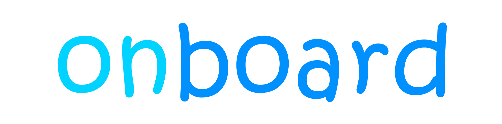
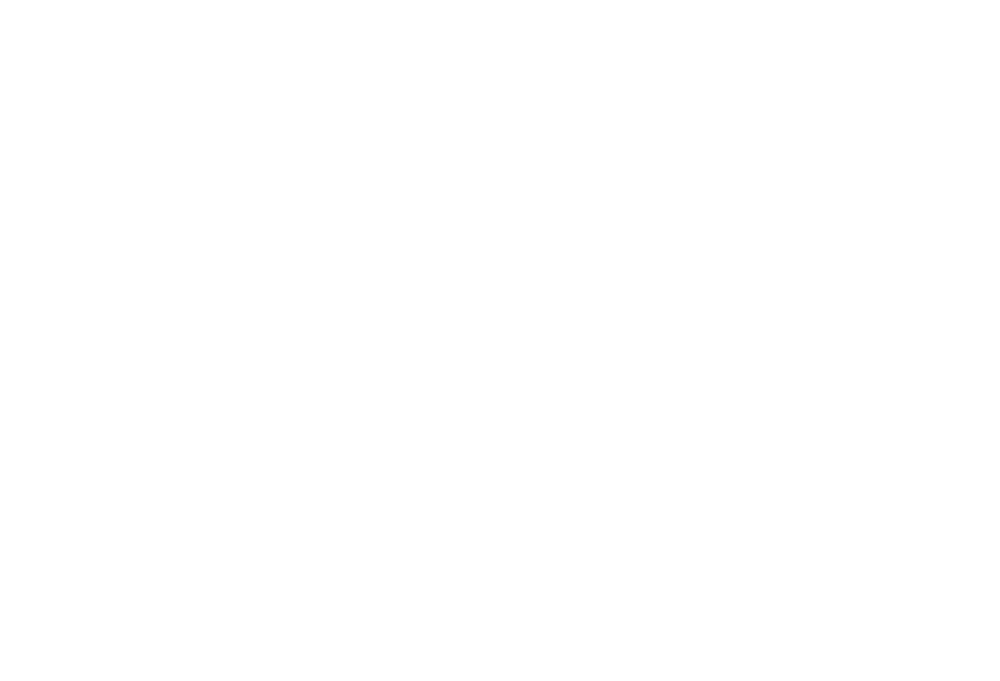
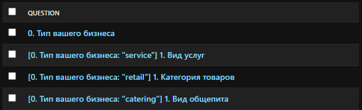
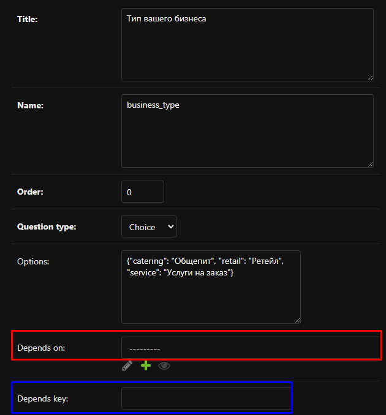

# **onboard - сервис онбординга с динамическим отображением**

<p align="center">
  
</p>

## 🎯 **Продуктовые цели сервиса**

1. Анкетирование потенциальных клиентов, с целью использования собранной информации для повышения конверсии в закрытие сделки отделом продаж.

2. Автоматическая преднастройка системы: показать необходимые разделы для данного типа и вида бизнеса, скрыть все то, что не релевантно.


## 💡 **Идея**

### **Главные критерии проекта:**

#### **Деление древа опроса на два: меняющие логику вопросы и не меняющие** 🔀

В конечной реализации это может быть полезно для внедрения большего количества информативных вопросов (их должно быть больше чем дробящих дерево) без долгой затраты времени. Условно выстроив дерево мы сможем на каждом уровне легко добавить или убрать вопросы не вникая в дерево.

#### **Поочерёдное отображение вопросов без перезагрузки страницы** 🔄

Конечной целью было реализовать отправку вопросов поочерёдно, вне зависимости от того является ли вопрос информативным или меняющим ветку.

#### **Простота прохождения вопроса** 😊

**Изначально было запланировано сделать несколько форм:**

- опциональный выбор (для ветвлений и вопросов не требующих ввода)
- строковые (для ввода имени, почты и т д)
- для целочисленных значений (вопросы по типу кол-ва людей в команде)
- для дробных (площадь зала)

**Но после реализации шаблона опционального выбора понял, что зачастую при первом знакомстве можно обусловиться категориями вместо уточнения всех чисел.**

#### **Гибкую систему хранения пользовательских данных** 📂

Задача была “изолировать” составляющего вопросы и просматривающего ответы от главных моделей. Таким образом получилось создать две модели для вопросов и ответов, 13 моделей для хранения информации о бизнесах пользователей и 1 модель для хранения пользовательских данных.

### 🛠️ **Установка** 

**1. Создание и активация виртуального окружения**

Переходим в нужную директорию, создаём виртуальное окружение

```powershell
> python -m venv .venv
```

**Активируем его**

```powershell
> .venv\Scripts\activate
```

**2. Клонирование репозитория**

```powershell
> git clone https://github.com/maxfraid/onboard.git
```

Переходим в корневую директорию проекта

```powershell
> cd onboard
```

**3. Установка зависимостей**

```powershell
> pip install -r requirements.txt
```

**4. Запуск**

Перед запуском необходимо убедиться, что вы находитесь в директории приложения:

```powershell
> cd onboard
```

Ваша рабочая директория должна выглядеть так:
```path
.../onboard/onboard
```

**Запускаем Django-приложение**

```powershell
> python manage.py runserver
```

### 🌳 **Тестовое дерево, включающего ветвления и объединения веток**

<p align="center">
  
</p>

*В дереве много условных ветвлений ради ветвлений, но для задач проекта не требовалась правдоподобность.*

### 👩‍💻 **Отображение моделей в Django admin**

```python
def __str__(self):
    return (
        # [Зависимость от вопроса: "ответ для этой ветки"] Текущий вопрос
        f"{f'[{str(self.depends_on.order) + ". " + str(self.depends_on.title)}: "{self.depends_key if self.depends_key else 'ANY'}"] ' if self.depends_on else ""}" + f"{str(self.order)}. " + self.title
    )
```

<p align="center">
  
</p>


### 🔗 **Установка зависимостей между вопросами**

Для создания зависимостей между вопросами было добавлено два поля:
- поле зависимости для установления зависимости от другого вопроса (выделено красным)
- ключ (ответ который нужно дать в предыдущем чтобы попасть на этот, выделено синим)

<p align="center">
  
</p>

### 📚 **Используемые библиотеки**

-   **Django >= 5.0.6**
-   **pip-tools >= 7.4.1**

### 📬 **Обратная связь**

По всем вопросам: **ferjenkill@gmail.com**