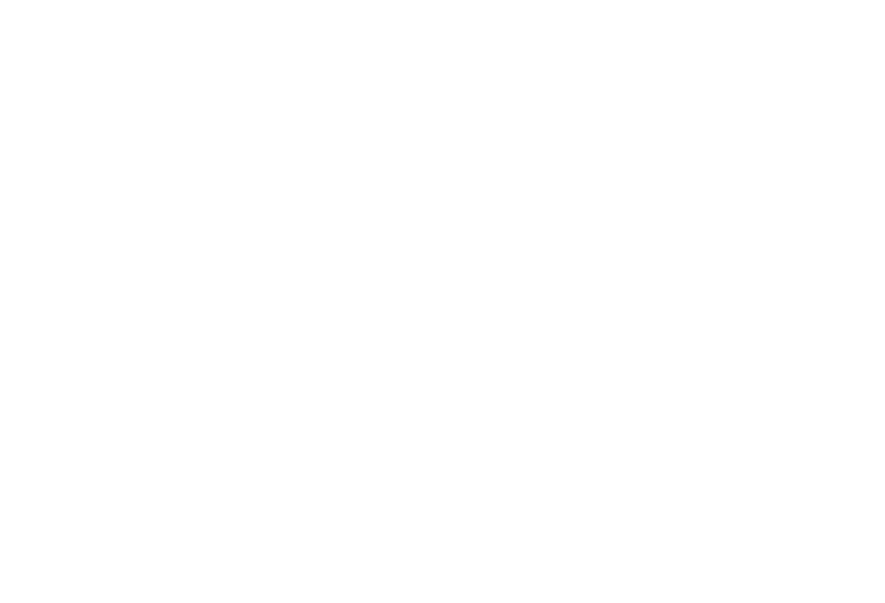

# onboard - сервис онбординга с динамическим отображением

## 🎯 Продуктовые цели сервиса

1. Анкетирование потенциальных клиентов, с целью использования собранной информации для повышения конверсии в закрытие сделки отделом продаж.

2. Автоматическая преднастройка системы: показать необходимые разделы для данного типа и вида бизнеса, скрыть все то, что не релевантно.

## 🌳 Дерево опроса

1. **Тип бизнеса**
    1. **Общепит**
        1. **Бар**
            1. **Есть кухонное помещение**
                1. **Да**
                    1. **Площадь кухонного помещения**
                2. **Нет**
            2. Площадь зала
            3. Кол-во сидячих мест
            4. Есть ли доставка
        2. **Кофейня**
            1. **Есть кухонное помещение**
                1. **Да**
                    1. **Площадь кухонного помещения**
                2. **Нет**
            2. Площадь зала
            3. Кол-во сидячих мест
            4. Есть ли доставка
        3. **Ресторан**
            1. Площадь зала
            2. Кол-во сидячих мест
            3. Есть ли доставка
        4. **Бургерная**
            1. Площадь зала
            2. Кол-во сидячих мест
            3. Есть ли доставка
    2. **Ритейл**
        1. **Категория товаров**
            1. **Книги**
            2. **Спорт**
            3. **Одежда**
        2. Площадь торгового зала
        3. Площадь складского помещения
    3. **Услуги на заказ**
        1. **Вид услуг**
            1. **Дизайн**
            2. **IT**
            3. **Музыка**
        2. **Есть офис**
            1. **Да**
                1. **Площадь офиса**
            2. **Нет**
    4. Режим работы
    5. Кол-во работников